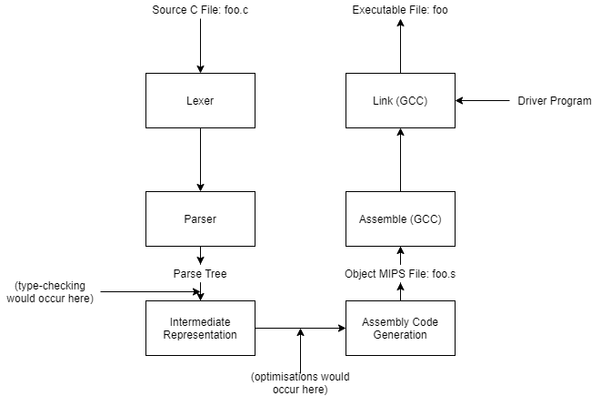

# C to MIPS Compiler

A project from the 2nd Year Module: Instruction Architectures and Compilers in Electronic and Information Engineering at Imperial College London in the Spring Term.  
Contributors: Ani Hazarika, Aryan Ghobadi

The specification for this project is available [here](specification.md).

Note:
-Compiler follows the functional order of the Compiler system as described in the lectures delivered to us. With a full Lexer to Lex tokens (Designed with Flex), a Parser that initialises code syntax in an Abstract Syntax Tree (AST) format, generating an intermediate representation (3-address code), and translating into MIPS assembly.
- The compiler was tested completely on functionality as to whether the genearated assembly produced the correct output when linked to the driver file and simulated on qemu-mips.
-The compiler was graded based on wholely correct C-code being tested, so there is no type-checking/general error-handling in the case of incorrect code.

